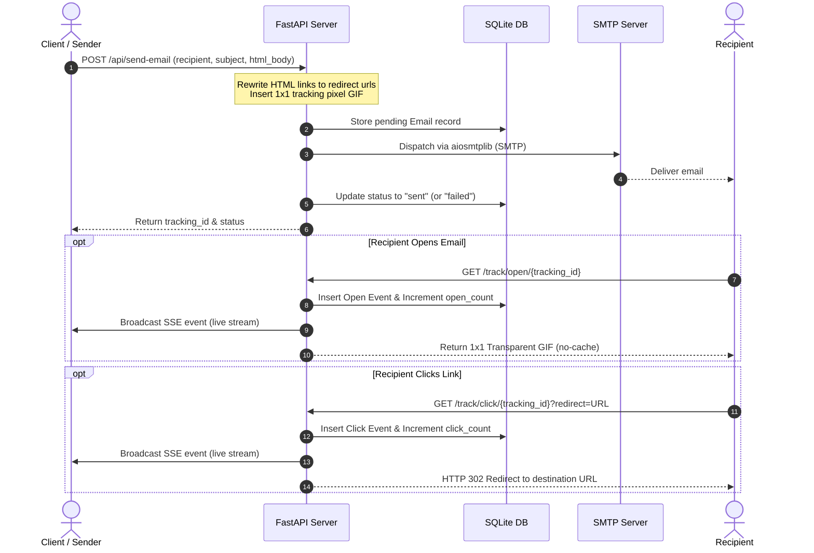

# 📨 Hybrid Email Tracker & Analytics Dashboard

A modern, self-hosted email delivery and engagement tracking platform. Built with **FastAPI**, **SQLAlchemy**, **SQLite**, and **aiosmtplib** for Namecheap Private Email (or any SMTP provider).

This project features a real-time monitoring dashboard, Server-Sent Events (SSE) stream for live tracking, automatic link rewriting, bounce/open webhooks, and comprehensive REST APIs.

---

## 🚀 Key Features

* **Zero Third-Party APIs**: No dependency on Mailgun, SendGrid, or other external tracking services.
* **Smart Tracking**:
  * **Open Tracking**: Automatic insertion of a hidden 1x1 transparent GIF tracking pixel.
  * **Click Tracking**: Automatic HTML link parsing and rewriting to track recipient clicks and securely redirect via HTTP 302.
* **Real-time Updates**: Live event feed on the dashboard powered by Server-Sent Events (SSE).
* **Robust Mail Delivery**: Asynchronous SMTP dispatch with configurable retry logic.
* **Comprehensive Analytics**: Dashboard metrics representing total emails sent, opened, clicked, bounced, and failed, along with open and click rates.
* **Legacy Compatibility**: Retains legacy tracking endpoints `/track/{email_id}` and `/click/{email_id}` to avoid breaking older emails.

---

## 🛠️ Technology Stack

* **Backend**: FastAPI (Python 3.10+)
* **Database**: SQLite (SQLAlchemy 2.0 ORM)
* **Email Client**: `aiosmtplib` (supports STARTTLS and Implicit TLS)
* **Frontend**: HTML5, Vanilla CSS, JavaScript (SSE EventSource)

---

## 📐 Architecture & Data Flow



---

## ⚙️ Configuration

Copy `.env.example` to `.env` (or create a `.env` file in the root directory) and set your mailbox credentials and public URL.

### Configuration Variables

| Variable | Type | Default | Description |
| --- | --- | --- | --- |
| `SMTP_HOST` | String | `mail.privateemail.com` | SMTP Server Hostname |
| `SMTP_PORT` | Integer | `587` | SMTP Server Port |
| `SMTP_EMAIL` | String | *Required* | SMTP username / sender email address |
| `SMTP_PASSWORD` | String | *Required* | SMTP mailbox password |
| `SMTP_FROM_NAME` | String | `Email Tracker` | Display name of the sender |
| `SMTP_USE_TLS` | Boolean | `false` | Enable implicit TLS (typically Port 465) |
| `SMTP_START_TLS`| Boolean | `true` | Enable STARTTLS (typically Port 587) |
| `DATABASE_URL` | String | `sqlite:///email_tracker.db` | Connection URL for SQLite database |
| `APP_URL` | String | `http://localhost:8000` | Publicly accessible absolute application URL |
| `COMPANY_NAME` | String | `Email Tracker` | Brand name displayed in default templates |
| `COMPANY_LOGO_URL`| String | `""` | Optional URL for email templates header logo |
| `MAX_BODY_SIZE` | Integer | `10485760` (10MB) | Maximum size allowed for email body in bytes |
| `MAX_SUBJECT_LENGTH`| Integer| `998` | Maximum length of the email subject |
| `APP_DEBUG` | Boolean | `true` | Runs FastAPI app in debug mode |

---

## 🏃 Getting Started

### 1. Setup Environment
Ensure you have Python 3.10+ installed.

```bash
# Create virtual environment
python -m venv venv

# Activate virtual environment
# On Windows:
venv\Scripts\activate
# On Linux/macOS:
source venv/bin/activate

# Install dependencies
pip install -r requirements.txt
```

### 2. Run the Application
Run the FastAPI application with Uvicorn:

```bash
uvicorn app.main:app --host 0.0.0.0 --port 8000 --reload
```

* **Interactive Swagger UI**: [http://localhost:8000/docs](http://localhost:8000/docs)
* **Monitoring Dashboard**: [http://localhost:8000/](http://localhost:8000/)

---

## 🔌 API Endpoints Reference

### 📧 Sending Emails

#### `POST /api/send-email`
Sends an SMTP email with automated link/open tracking.

**Request Body (`application/json`)**:
```json
{
  "recipient": "recipient@example.com",
  "subject": "Greetings from Email Tracker",
  "body": "<p>Hello! Please visit our <a href=\"https://google.com\">website</a>.</p>",
  "attachments": [
    {
      "filename": "document.pdf",
      "content_base64": "SGVsbG8gV29ybGQh",
      "content_type": "application/pdf"
    }
  ]
}
```

**Response (`200 OK`)**:
```json
{
  "id": "e4a77038-7096-419b-ab29-be0cb2910793",
  "tracking_id": "18cf6f5e-13c5-4cb2-83b6-96b63fcbf794",
  "status": "sent",
  "message": "Email sent successfully"
}
```

---

### 🔍 Tracking Endpoints

#### `GET /track/open/{tracking_id}`
Tracks when a recipient opens an email. Appends tracking event and returns a 1x1 transparent GIF.

#### `GET /track/click/{tracking_id}?redirect={url}`
Tracks when a recipient clicks a rewritten link in the email body, records the event, and redirects to the target destination.

#### `POST /api/webhook/open`
Accepts a webhook payload to manually record email opens.
* **Payload**: `{"tracking_id": "uuid"}` or `{"email_id": "uuid"}`

---

### 📊 Analytics & Reporting

#### `GET /api/analytics`
Fetch aggregated stats for sent, opened, clicked, bounced, and failed emails.

**Response (`200 OK`)**:
```json
{
  "total": 12,
  "sent": 10,
  "opened": 4,
  "clicked": 2,
  "bounced": 1,
  "failed": 1,
  "open_rate": 40.0,
  "click_rate": 20.0
}
```

#### `GET /api/emails`
Fetch a paginated list of sent emails. Supports search query (recipient, subject) and status filtering.

| Query Param | Type | Default | Description |
| --- | --- | --- | --- |
| `page` | Integer | `1` | Page number |
| `per_page` | Integer | `20` | Items per page (Max 100) |
| `search` | String | `""` | Search text |
| `status` | String | `""` | Status filter (`sent`, `opened`, `clicked`, `failed`, `bounced`) |

#### `GET /api/email/{email_id}/tracking`
Retrieve details of a specific email, including its configuration, counts, and sequential events logs.

**Response (`200 OK`)**:
```json
{
  "id": "e4a77038-7096-419b-ab29-be0cb2910793",
  "tracking_id": "18cf6f5e-13c5-4cb2-83b6-96b63fcbf794",
  "recipient": "recipient@example.com",
  "subject": "Greetings from Email Tracker",
  "status": "sent",
  "display_status": "Opened (Estimated)",
  "sent_at": "2026-07-01T09:00:00Z",
  "opened_at": "2026-07-01T09:05:00Z",
  "open_count": 1,
  "first_open_ip": "192.168.1.50",
  "first_open_user_agent": "Mozilla/5.0 ...",
  "events": [
    {
      "id": 1,
      "type": "open",
      "timestamp": "2026-07-01T09:05:00Z",
      "ip": "192.168.1.50",
      "user_agent": "Mozilla/5.0 ..."
    }
  ]
}
```

#### `GET /api/events`
Establish a persistent connection (Server-Sent Events) to stream live events as they occur in real-time.

---

### 💥 Bounce Webhook

#### `POST /api/bounce-webhook`
Interface for external mail systems/webhooks to notify of bounced emails.
* **Query Params**: `email_id` (String), `reason` (String)

---

## 🧪 Running Tests

To run the unit tests test suite, execute:

```bash
python -m unittest discover -s tests -v
```
